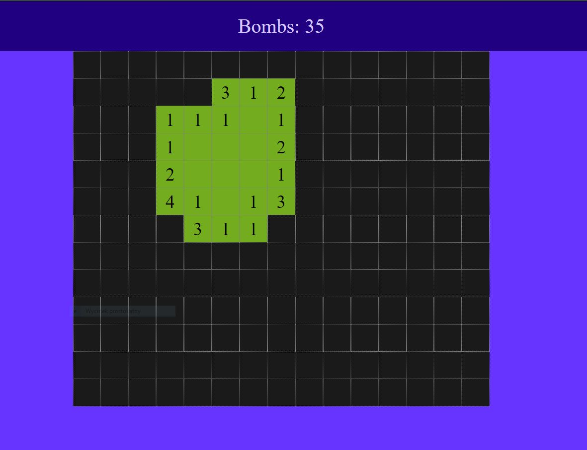

# Saper
## Table of contents
* [General info](#general-info)
* [Technologies](#technologies)
* [How to use this app?](#how-to-use-schegen)
* [Setup](#setup)
* [Image](#image)

## General info
This is my version of Minesweeper. I have never seen any sweeper codes before. This code idea is 100% mine.

## Technologies
* React

## How to use this app?
1. Download this repo or go to (https://koxsaper.netlify.app)
2. Select game settings
3. Play

## Setup
* npm start

## Image
